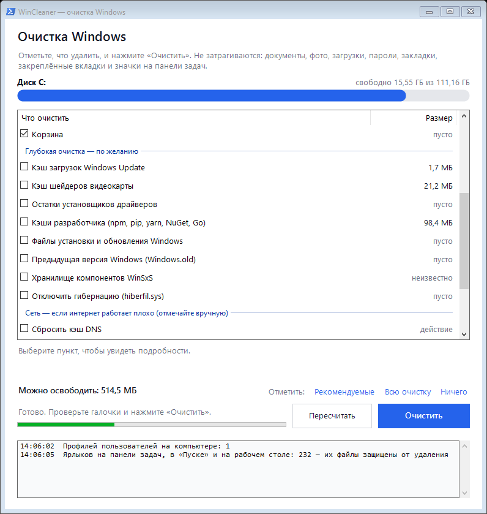
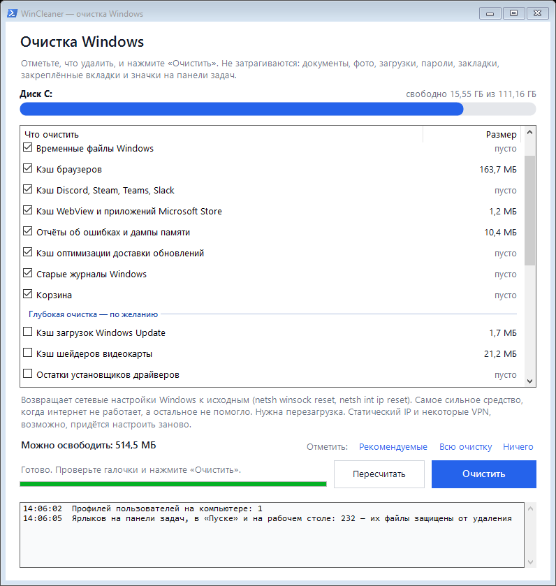

# WinCleaner — очистка Windows

Программа убирает с диска временные файлы, кэши и прочий мусор, который Windows и программы
копят годами, а ещё чинит типичные проблемы с интернетом (DNS, IP-адрес, прокси, Winsock).
Одно окно, один файл `WinCleaner.exe`, ничего не нужно устанавливать. Работает на Windows 10 и 11.



- **Сначала считает, потом удаляет.** При запуске программа показывает, сколько места занимает
  каждый пункт. Удаление начинается только после нажатия «Очистить».
- **Личные файлы не трогает.** Документы, фото, «Загрузки», рабочий стол, пароли, cookies,
  история и вкладки браузеров остаются на месте.
- **Сразу для всех пользователей компьютера.** Если в Windows несколько учётных записей,
  чистятся временные файлы и кэши каждой.

---

## Содержание

1. [Скачать и запустить](#1-скачать-и-запустить)
2. [Как пользоваться](#2-как-пользоваться)
3. [Что именно удаляется](#3-что-именно-удаляется)
4. [Что программа не трогает никогда](#4-что-программа-не-трогает-никогда)
5. [Вопросы и проблемы](#5-вопросы-и-проблемы)
6. [Собрать из исходников](#6-собрать-из-исходников)
7. [Как это устроено внутри](#7-как-это-устроено-внутри)

---

## 1. Скачать и запустить

1. Откройте страницу **[Releases](../../releases/latest)** и скачайте `WinCleaner.exe`.
2. Положите файл куда угодно: на рабочий стол, в «Загрузки», на флешку. Установка не нужна.
3. Запустите двойным щелчком.
4. Windows спросит: *«Разрешить этому приложению вносить изменения на вашем устройстве?»*.
   Нажмите **«Да»**. Права администратора нужны, чтобы чистить системные папки
   (`C:\Windows\Temp`, кэш обновлений и т. п.) и папки других пользователей.

### Если Windows показывает синее окно «Windows защитила ваш компьютер»

Так SmartScreen реагирует на любую программу без платной цифровой подписи, скачанную
из интернета. Чтобы запустить:

1. Нажмите **«Подробнее»**.
2. Нажмите **«Выполнить в любом случае»**.

Второй раз окно уже не появится. Если не хотите доверять готовому exe, соберите его сами из
исходников за минуту (см. [раздел 6](#6-собрать-из-исходников)).

### Требования

| | |
|---|---|
| Система | Windows 10 или Windows 11 (32 или 64 бит). На Windows 7/8.1 тоже запустится, если стоит .NET Framework 4.5+ |
| Права | Учётная запись администратора (или пароль администратора для окна UAC) |
| Место | ~100 КБ, программа ничего не устанавливает и не оставляет после себя |

---

## 2. Как пользоваться

1. **Запустите программу** и подождите несколько секунд: она сама посчитает, сколько места
   занимает каждый пункт. Размеры появятся в правой колонке, внизу будет итог
   «Можно освободить: …».
2. **Посмотрите на галочки.** По умолчанию отмечены только безопасные пункты (группа
   «Рекомендуется»). Щёлкните по любому пункту, и под списком появится описание: что это за
   файлы и чем грозит их удаление.
3. **Пункты из группы «Глубокая очистка»** отмечайте по желанию, прочитав описание.
   Быстро отметить набор можно ссылками справа внизу: *Рекомендуемые / Всю очистку / Ничего*.
   **Группа «Сеть»** в самом низу списка никогда не отмечается сама: включайте её пункты
   вручную, только если есть проблемы с интернетом (см. [порядок действий](#если-плохо-работает-интернет)).
4. **Нажмите «Очистить».**
   - Если открыт браузер (или Discord, Steam и т. п.), программа попросит закрыть его
     **самостоятельно**. Кэш открытой программы почистить нельзя, а сама программа окна не
     закрывает, чтобы не потерялись окна и закреплённые вкладки. Браузер закрывайте через
     меню → «Выход», затем нажмите «Повторить». «Пропустить» почистит всё остальное без кэша
     этой программы.
   - Если отмечены необратимые пункты (корзина, Windows.old, гибернация), программа
     переспросит и покажет, сколько они занимают.
5. **Дождитесь окончания.** Ход работы виден в журнале внизу окна. В конце появится
   сообщение, сколько освобождено и сколько места было и стало на диске C.
   Остановить очистку можно кнопкой «Остановить»: текущий пункт доделается, остальные
   пропустятся.
6. После очистки кнопка **«Пересчитать»** снова покажет актуальные размеры.

> **Совет.** Запускайте раз в месяц-два или когда на диске C заканчивается место.
> Временные файлы и кэши снова накопятся, это нормально.

---

## 3. Что именно удаляется

### Рекомендуется — безопасно (отмечено по умолчанию)

| Пункт | Что удаляется | Последствия |
|---|---|---|
| Временные файлы программ | `%LOCALAPPDATA%\Temp` всех пользователей. Файлы **моложе суток пропускаются** | Никаких |
| Временные файлы Windows | `C:\Windows\Temp`, тоже только старше суток | Никаких |
| Кэш браузеров | Папки кэша Chrome, Edge, Яндекс Браузера, Opera / Opera GX, Brave, Vivaldi, Chromium, Firefox — во всех профилях браузера | Сайты при первом заходе откроются чуть медленнее. Закладки и панель закладок, закреплённые вкладки, табло и экспресс-панель, пароли, история, cookies не затрагиваются |
| Кэш Discord, Steam, Teams, Slack | Кэш встроенного браузера этих программ | Переписка, настройки и игры не затрагиваются |
| Кэш WebView и приложений Microsoft Store | `INetCache` и временные папки приложений из Store | Никаких |
| Отчёты об ошибках и дампы памяти | Отчёты Windows Error Reporting, `Minidump`, `MEMORY.DMP`, `LiveKernelReports`, `CrashDumps` | Нельзя будет расследовать старые «синие экраны» по дампам |
| Кэш оптимизации доставки обновлений | Куски обновлений, которыми компьютер делится с другими в сети | Windows скачает заново, если понадобится |
| Старые журналы Windows | Логи `CBS`, `DISM`, `WindowsUpdate` старше 7 дней | Никаких |
| Корзина | Содержимое корзины на всех дисках | **Удалённые файлы нельзя будет восстановить** (программа переспросит) |

### Глубокая очистка — по желанию (не отмечено по умолчанию)

| Пункт | Что удаляется | Последствия |
|---|---|---|
| Кэш загрузок Windows Update | `C:\Windows\SoftwareDistribution\Download`. Службы обновления на время очистки останавливаются и затем запускаются снова | Никаких: это установочные файлы уже установленных обновлений |
| Кэш шейдеров видеокарты | Кэши DirectX, NVIDIA, AMD, Intel | Пересоздаются сами; первые запуски игр могут коротко подтормаживать |
| Остатки установщиков драйверов | `C:\AMD`, `C:\NVIDIA`, скачанные драйверы NVIDIA | Никаких: установленным драйверам они не нужны |
| Кэши разработчика | npm, yarn, pip, NuGet, Go | Пакеты скачаются заново при следующей сборке |
| Файлы установки и обновления Windows | Остатки крупных обновлений (`$WINDOWS.~BT` и др.), журналы установки, старые файлы chkdsk. Делает встроенная «Очистка диска» Windows | Никаких. Может идти несколько минут, откроется окошко «Очистки диска» |
| Предыдущая версия Windows (Windows.old) | Копия прошлой версии Windows после крупного обновления | **Откатиться на прошлую версию Windows будет нельзя** (программа переспросит) |
| Хранилище компонентов WinSxS | Заменённые старые версии системных компонентов (`DISM /StartComponentCleanup`) | Безопасно, но идёт **5–30 минут**. Размер заранее неизвестен |
| Отключить гибернацию | Файл `hiberfil.sys` (обычно несколько ГБ) | **Пропадут «Гибернация» и «Быстрый запуск»**. На ноутбуках лучше не трогать. Вернуть: см. [вопросы](#5-вопросы-и-проблемы) |

### Сеть — если интернет работает плохо (не отмечено никогда)

Эти пункты не освобождают место, а выполняют действие: в колонке размера у них написано
«действие», после выполнения — «✓ выполнено». Команды и их результат видны в журнале.



| Пункт | Что делает | Когда помогает | Последствия |
|---|---|---|---|
| Сбросить кэш DNS | `ipconfig /flushdns` | Отдельные сайты не открываются или открывается старая версия сайта | Никаких |
| Очистить кэш ARP и NetBIOS | `netsh interface ip delete arpcache`, `nbtstat -R`, `nbtstat -RR` | Компьютер не видит роутер, принтер или другие компьютеры после их замены | Никаких |
| Получить IP-адрес заново | `ipconfig /release`, затем `ipconfig /renew` | «Без доступа к интернету», конфликт IP-адресов, после смены роутера | Интернет пропадёт на несколько секунд |
| Сбросить прокси | `netsh winhttp reset proxy`, выключает ручной прокси и скрипт автонастройки в настройках Интернета текущего пользователя | Сайты или Microsoft Store перестали открываться после VPN, «ускорителей интернета», вирусов | **Если прокси нужен специально (на работе), его придётся настроить заново** |
| Сбросить Winsock и TCP/IP | `netsh winsock reset`, `netsh int ip reset`, `netsh int ipv6 reset` | Интернет не работает совсем, а остальное не помогло | **Нужна перезагрузка** (программа предложит). Статический IP и некоторые VPN, возможно, придётся настроить заново |

#### Если плохо работает интернет

Идите от простого к сложному, проверяя интернет после каждого шага:

1. Перезагрузите роутер (выключить из розетки на 30 секунд).
2. Отметьте **«Сбросить кэш DNS»**, **«Очистить кэш ARP и NetBIOS»** и
   **«Получить IP-адрес заново»**, нажмите «Очистить».
3. Если после VPN или какой-то программы «для ускорения» сайты не открываются, выполните
   **«Сбросить прокси»**.
4. Если ничего не помогло, выполните **«Сбросить Winsock и TCP/IP»** и перезагрузите компьютер.

Кроме этого, после любой очистки программа сама сбрасывает кэш DNS (`ipconfig /flushdns`).

---

## 4. Что программа не трогает никогда

- Документы, фото, видео, музыку, «Загрузки», рабочий стол — любые ваши файлы.
- **Закладки и панель закладок** браузеров вместе с их значками. В Chrome, Edge, Яндексе, Opera,
  Brave и Vivaldi это файлы `Bookmarks` и `Favicons`, в Firefox — `places.sqlite` и
  `favicons.sqlite`. Программа удаляет только папки с кэшем, а эти файлы лежат отдельно.
- **Закреплённые вкладки, окна и сессии** браузеров, табло Яндекса, экспресс-панель Opera,
  плитки и их картинки на новой вкладке. Открытый браузер программа не закрывает сама, а просит
  закрыть его через меню «Выход»: так браузер сохраняет все окна и закреплённые вкладки.
- **Закрепы на панели задач и в «Пуске», ярлыки на рабочем столе и их связь с программами.**
  Перед очисткой программа читает все ярлыки на панели задач, в «Пуске» и на рабочем столе и не
  удаляет ни одного файла или папки, на которые они ссылаются (программу, значок, рабочую папку),
  даже если они лежат во временной папке. Кэш значков Windows, списки переходов (меню по правому
  щелчку на панели задач) и ассоциации файлов тоже не трогаются.
- Пароли, cookies, историю и расширения браузеров.
- Переписку и настройки мессенджеров, игры и их сохранения.
- Точки восстановления системы.
- Папку `Prefetch`: её очистка не ускоряет, а **замедляет** запуск программ, хотя многие
  «чистилки» так делают.
- Файлы, занятые запущенными программами: они молча пропускаются.
- Символические ссылки и точки соединения (junction): программа не заходит внутрь и не может
  случайно удалить то, на что они указывают.
- Файлы OneDrive «только в облаке».

---

## 5. Вопросы и проблемы

**Освободилось меньше, чем показывал подсчёт.**
Нормальная ситуация. Часть файлов может быть занята запущенными программами, такие файлы
пропускаются. Если браузер остался открытым, его кэш тоже пропускается: в журнале будет
строка «пропущено — программа открыта».

**Напротив WinSxS написано «неизвестно».**
Windows не умеет быстро оценить, сколько освободит очистка хранилища компонентов.
Итог будет виден после выполнения.

**В журнале: «DISM завершился с кодом …».**
Обычно Windows ждёт перезагрузки после установки обновлений. Перезагрузите компьютер и
запустите этот пункт снова.

**После сброса Winsock и TCP/IP пропал интернет.**
Сначала перезагрузите компьютер: без перезагрузки сброс не завершён. Если у вас был
статический IP-адрес (обычно на работе или при прямом подключении кабеля провайдера), задайте
его заново: «Параметры» → «Сеть и Интернет» → адаптер → «Свойства» → «Назначение IP».
Если перестал работать VPN-клиент, переустановите его.

**После «Сбросить прокси» не работает интернет на работе.**
В сети стоял обязательный прокси. Попросите администратора настроить его снова или
восстановите адрес прокси в «Параметры» → «Сеть и Интернет» → «Прокси-сервер».

**Как вернуть гибернацию и «Быстрый запуск»?**
Откройте «Командную строку» или PowerShell от имени администратора и выполните:

```
powercfg /hibernate on
```

**Антивирус ругается на программу.**
Некоторые антивирусы настороженно относятся к неподписанным программам, которые удаляют
файлы и останавливают службы. Исходный код полностью открыт в этом репозитории
(`src/WinCleaner.cs`), exe можно собрать самому (см. ниже).

**Станет ли компьютер быстрее?**
Главный эффект — освобождённое место на диске. Заметный прирост скорости будет, если диск C был
почти заполнен: Windows плохо работает, когда свободно меньше 10–15%. Индикатор диска вверху
окна краснеет, когда свободно меньше 10%.

**Можно ли запускать часто?**
Да, программа безопасна для регулярного запуска. Но смысла чаще раза в пару недель нет:
кэши нужны программам и быстро накапливаются снова.

**Можно ли запускать с флешки на чужом компьютере?**
Да. Скопируйте `WinCleaner.exe` и запустите, после программы ничего не остаётся.

---

## 6. Собрать из исходников

Ничего устанавливать не нужно: программа собирается компилятором C#, который уже есть в любой
Windows 10/11 в составе .NET Framework.

1. Скачайте репозиторий: зелёная кнопка **Code → Download ZIP**, затем распакуйте архив.
   Или так:
   ```
   git clone https://github.com/Sawaiii/WinCleaner.git
   ```
2. Запустите `build.cmd` двойным щелчком (или из командной строки).
3. Рядом появится `WinCleaner.exe`.

Если иконки `src\app.ico` нет, `build.cmd` сам нарисует её скриптом `src\make-icon.ps1`.

### Структура

```
WinCleaner/
├─ build.cmd            сборка exe встроенным csc.exe
├─ src/
│  ├─ WinCleaner.cs     весь код программы (интерфейс + логика очистки)
│  ├─ app.manifest      запрос прав администратора, поддержка высокого DPI
│  ├─ app.ico           иконка
│  └─ make-icon.ps1     генератор иконки
└─ docs/                скриншоты для README
```

### Как добавить свою папку для очистки

В `src/WinCleaner.cs`, в методе `Catalog.Build()`, добавьте пункт по образцу соседних:

```csharp
L.Add(new CleanItem
{
    Title = "Кэш моей программы",
    Description = "Что это и чем грозит удаление.",
    Run = c => ForUsers(u => Fs.ClearDir(c, Path.Combine(u, @"AppData\Local\MyApp\Cache")))
});
```

`Deep = true` помещает пункт в группу «Глубокая очистка», `Warning = "..."` включает
подтверждение перед удалением. Затем запустите `build.cmd`.

> Код написан на C# 5: встроенный в Windows компилятор не знает более новый синтаксис
> (`$"..."`, `?.` и т. п.).

---

## 7. Как это устроено внутри

- **Сухой прогон.** Каждый пункт выполняется одним и тем же кодом в двух режимах: «посчитать»
  (при запуске и по кнопке «Пересчитать») и «удалить». Поэтому подсчёт честный: считается
  ровно то, что будет удаляться.
- **Безопасное удаление.** Папки обходятся без рекурсии, со своим стеком. Точки повторной
  обработки (junction, symlink, облачные файлы OneDrive) пропускаются, внутрь не заходим.
  Занятые файлы пропускаются. Удаляется только содержимое папок кэша, сами папки остаются.
- **Фильтр по возрасту.** Во временных папках удаляются только файлы, у которых и дата создания,
  и дата изменения старше 24 часов, чтобы не сломать работающий прямо сейчас установщик.
- **Все пользователи.** Профили берутся из реестра
  (`HKLM\SOFTWARE\Microsoft\Windows NT\CurrentVersion\ProfileList`), включая учётные записи
  Microsoft и Azure AD и профили, лежащие не на диске C.
- **Системные инструменты Windows** там, где они надёжнее ручного удаления:
  - `cleanmgr /sagerun` для файлов установки и Windows.old (пункты включаются временно
    через `StateFlags` в реестре и после работы убираются);
  - `DISM /Online /Cleanup-Image /StartComponentCleanup` для WinSxS (без `/ResetBase`,
    чтобы обновления можно было удалить);
  - `Delete-DeliveryOptimizationCache` для кэша доставки;
  - `powercfg /hibernate off` для гибернации;
  - `SHEmptyRecycleBin` для корзины;
  - `ipconfig`, `netsh`, `nbtstat` для сетевых пунктов (код возврата каждой команды пишется
    в журнал, при ошибке — и последняя строка её вывода).
- **Открытые программы.** Окна программа не закрывает никогда: если закрывать окна браузера по
  одному, он запомнит только последнее, и остальные окна с закреплёнными вкладками пропадут.
  Завершаются только фоновые процессы без окон (например, Edge с «ускорением запуска»), когда
  сессия браузера уже сохранена. Steam не завершается даже в фоне.
- **Защита ярлыков.** Перед подсчётом и перед очисткой программа читает все ярлыки `.lnk` на
  панели задач (`Quick Launch\User Pinned`), в «Пуске» и на рабочем столе всех пользователей.
  Файлы, на которые они указывают (программа, значок, рабочая папка), и папки с этими файлами
  попадают в защищённый список и не удаляются ни при каких условиях.
